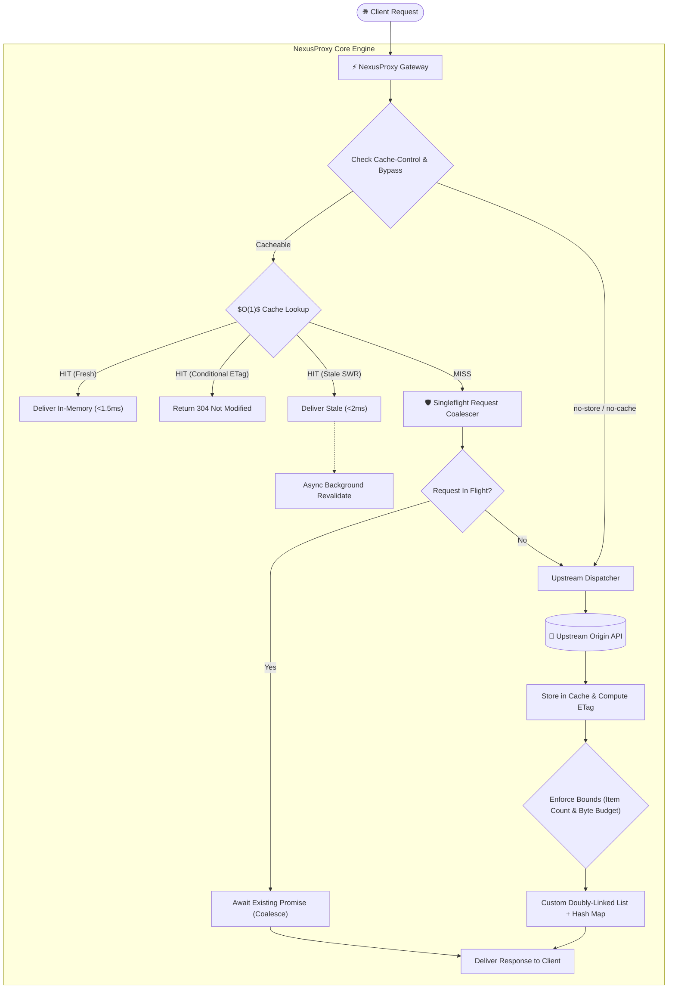

# ⚡ NexusProxy: High-Performance Caching Gateway & Telemetry Engine

[](https://nodejs.org/)
[](https://opensource.org/licenses/MIT)
[](https://datatracker.ietf.org/doc/html/rfc7234)
[]()

> A production-grade, low-latency reverse caching proxy engineered with custom **$O(1)$ Doubly-Linked List + Hash Map** data structures, **Singleflight (Cache Stampede / Thundering Herd)** mitigation, **RFC 7234 HTTP caching compliance**, and real-time interactive telemetry.

---

## 🏗 System Architecture



---

## 📊 Performance Benchmarks

Validated against local origin running real workloads with deterministic latency:

| Scenario | Samples | Avg Latency | P50 Latency | P90 Latency | P99 Latency | Latency Reduction |
| :--- | :---: | :---: | :---: | :---: | :---: | :---: |
| **Direct Upstream Origin** | 20 | 66.17 ms | 62.36 ms | 67.66 ms | 138.05 ms | Baseline |
| **Proxy Cache Miss (Cold)** | 20 | 63.24 ms | 62.70 ms | 64.37 ms | 82.88 ms | ~0% (Network bound) |
| **Proxy Cache Hit (Warm Memory)** | 500 | **1.51 ms** | **1.42 ms** | **1.89 ms** | **2.88 ms** | **⚡ 97.72% Drop** |

### 🛡️ Cache Stampede (Thundering Herd) Test:
* **Workload**: 100 simultaneous concurrent requests to an uncached heavy endpoint.
* **Without Singleflight**: 100 separate database / origin queries dispatched at the same instant (potential cascade failure).
* **With NexusProxy Singleflight**: **1** single origin fetch dispatched; **99 requests coalesced** into the identical promise. All 100 clients served in **330ms** total with zero duplicate upstream queries.

---

## 🚀 Key Engineering Features

### 1. True $O(1)$ Doubly Linked List + Hash Map Data Structure
* Built with explicit bidirectional pointers (`prev`, `next`) and dummy **Head** (Most Recently Used) and **Tail** (Least Recently Used) sentinel nodes.
* Eliminates costly $O(N)$ array shifts on evictions and repositionings.
* Supports **dynamic byte-level memory limits** (calculates exact UTF-8 / binary payload byte size) rather than naive item counts.
* Pluggable eviction policy architecture: includes both **LRU** (temporal locality) and **LFU** (frequency buckets for access pattern resilience).

### 2. Singleflight Request Coalescing (Cache Stampede Mitigation)
* Implements the Go-style `singleflight` concurrency pattern for Node.js.
* Tracks in-flight promises by cache key. When dozens of parallel requests miss cache simultaneously, only one upstream request is dispatched, preventing database exhaustion.

### 3. RFC 7234 HTTP Caching & Conditional Requests
* **`Cache-Control` Directives**: Fully parses and respects `max-age`, `s-maxage`, `no-cache`, `no-store`, `must-revalidate`, and `stale-while-revalidate`.
* **ETag Generation & 304 Validation**: Generates cryptographic SHA-1 entity tags. When clients supply `If-None-Match`, returns HTTP `304 Not Modified` with zero response body.
* **Stale-While-Revalidate (SWR)**: Delivers instant cached data to the client if within the SWR window while revalidating asynchronously in the background.

### 4. Interactive Real-Time Developer Dashboard
* **Visual Linked-List Memory Inspector**: Watch nodes dynamically move from Head (MRU) to Tail (LRU) as requests arrive, with real-time TTL countdown bars.
* **1-Click Burst Simulator**: Trigger a 50-request concurrent burst directly from the UI to watch Singleflight request coalescing in action.
* **Live Telemetry Strip**: Real-time QPS, P50/P99 latency graph, hit ratio percentage, and upstream bandwidth saved.
* **Header & Payload Inspector**: Review incoming and upstream HTTP headers and cache metadata.

---

## 📂 Project Structure

```bash
├── public/                     # Frontend Dashboard & Visualizer
│   ├── index.html              # Modern dark-theme telemetry interface
│   ├── style.css               # Clean responsive styling & animations
│   └── app.js                  # Chart.js telemetry & linked list rendering
├── src/
│   ├── cache/
│   │   ├── DoublyLinkedList.js # O(1) Sentinel Node Doubly-Linked List
│   │   ├── LRUCache.js         # Low-level LRU Cache (Hash Map + DLL)
│   │   ├── LFUCache.js         # O(1) LFU Cache with Frequency Buckets
│   │   └── CacheEngine.js      # Unified Manager with Policy Switching
│   ├── gateway/
│   │   ├── HttpCachePolicy.js  # RFC 7234 Parser, ETags, & 304 Validator
│   │   ├── Singleflight.js     # Request Coalescing (Stampede Mitigation)
│   │   └── ProxyHandler.js     # Reverse Proxy & SWR Background Worker
│   ├── mock/
│   │   └── upstreamServer.js   # Built-in Realistic Mock Origin (Products, Queries)
│   ├── telemetry/
│   │   └── MetricsTracker.js   # P50/P90/P99 percentiles & QPS engine
│   └── utils/
│       └── byteSize.js         # Accurate memory byte-size estimator
├── test/
│   ├── lru.test.js             # Unit tests for LRU/LFU, TTL, & Memory bounds
│   └── gateway.test.js         # Unit tests for Singleflight & RFC 7234
├── scripts/
│   └── benchmark.js            # Automated P50/P99 benchmark runner
├── Dockerfile                  # Production container definition
├── docker-compose.yml          # Container orchestration
├── package.json                # Project dependencies & scripts
├── RESUME_BULLETS.md           # Recruiter-ready bullet points & interview prep
└── README.md                   # System documentation
```

---

## 💻 Quickstart

### Prerequisites
* Node.js v18+ (tested on v20+)
* npm

### Installation & Launch
```bash
# 1. Clone repository
git clone https://github.com/sushant-1212/lru-cache-proxy.git
cd lru-cache-proxy

# 2. Install dependencies
npm install

# 3. Start the Gateway & Dashboard
npm start
```
Open **`http://localhost:3000`** in your browser to access the interactive dashboard.

### Run Automated Tests
```bash
npm test
```

### Run Benchmarking Suite
```bash
npm run bench
```

### Run with Docker
```bash
docker compose up --build
```

---

## 📡 API Reference

### 1. Proxy Route
`GET /proxy?url=<target_url>`
Interprets cache headers, checks memory cache, coalesces misses, and proxies requests.
* **Headers Returned**:
  * `X-Cache`: `HIT` | `MISS` | `STALE` | `BYPASS`
  * `X-Response-Time-Ms`: Latency in milliseconds
  * `X-Singleflight-Coalesced`: `true` | `false`
  * `Age`: Time in seconds since entry was cached
  * `ETag`: Cryptographic entity tag for client caching

### 2. Cache Telemetry & Introspection
* `GET /api/cache`: Returns ordered list of active nodes, memory byte footprint, and eviction log.
* `POST /api/cache/purge`: Flushes all cache nodes.
* `DELETE /api/cache/key?url=<target>`: Invalidate specific cached URI.
* `POST /api/cache/policy`: Switch eviction policy (`{"policy": "LRU" | "LFU"}`).
* `POST /api/cache/capacity`: Adjust active capacity limits (`{"capacity": 5}`).
* `GET /api/metrics`: Real-time QPS, P50/P90/P99 latencies, hit ratio, and bytes saved.

---

## 📜 License
MIT © Sushant